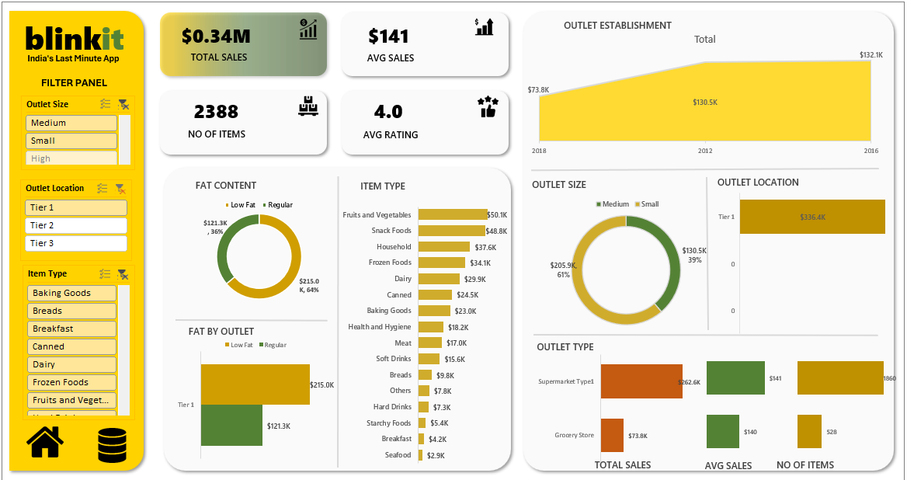

# Blinkit-Sales-Performance-Dashboard

## 🚀 Project Overview
Blinkit-Sales-Performance-Dashboard is an interactive Excel dashboard designed to analyze Blinkit retail sales data and generate business insights. The dashboard helps in understanding sales trends, outlet performance, customer preferences, and product demand using interactive visualizations and KPI metrics.

---

## 🛠 Tools Used
- Microsoft Excel
- Pivot Tables
- Pivot Charts
- Slicers
- Data Cleaning & Transformation

---

## 📈 Key Insights
- 💰 Total Sales reached **$1.20M**
- 🏪 Tier 3 outlets generated the highest sales
- 🛒 Fruits & Vegetables and Snack Foods are top-performing categories
- 📦 Medium and High-size outlets contribute most of the revenue
- 🧈 Low-fat products dominate overall sales
- ⭐ Average customer rating is **4.0**

---

## 📸 Dashboard Preview

---

## 📁 Files Included
- `Blinkit-Sales-Performance-Dashboard.xlsx`
- `dashboard_preview.png`
- `README.md`

---

## 🎯 Project Objective
The objective of this project is to analyze retail sales performance and identify trends, customer preferences, and outlet efficiency through interactive dashboards and data-driven insights.

---

## 🔍 Features
- Interactive filter panel
- KPI tracking (Sales, Ratings, Items)
- Outlet performance analysis
- Product category analysis
- Sales trend visualization
- User-friendly dashboard design

---

## 💡 Business Impact
This dashboard helps businesses:
- Monitor sales performance
- Identify high-performing outlets and products
- Understand customer buying patterns
- Make data-driven operational decisions

---

## 👤 Author
Zafar Ahmad
